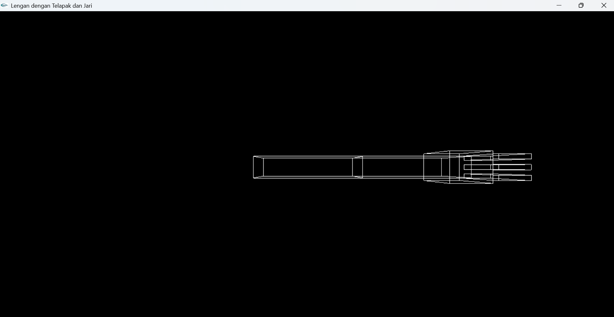
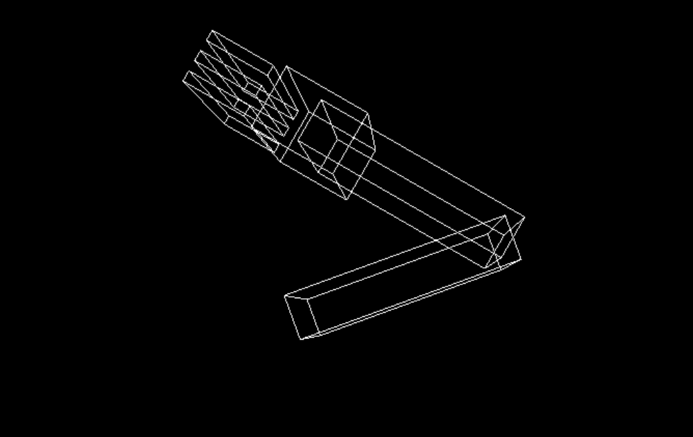
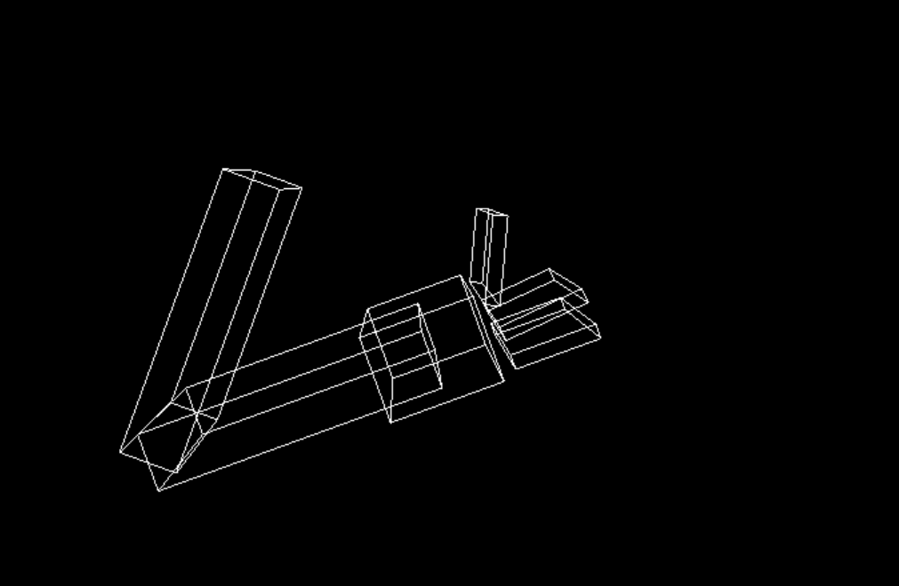
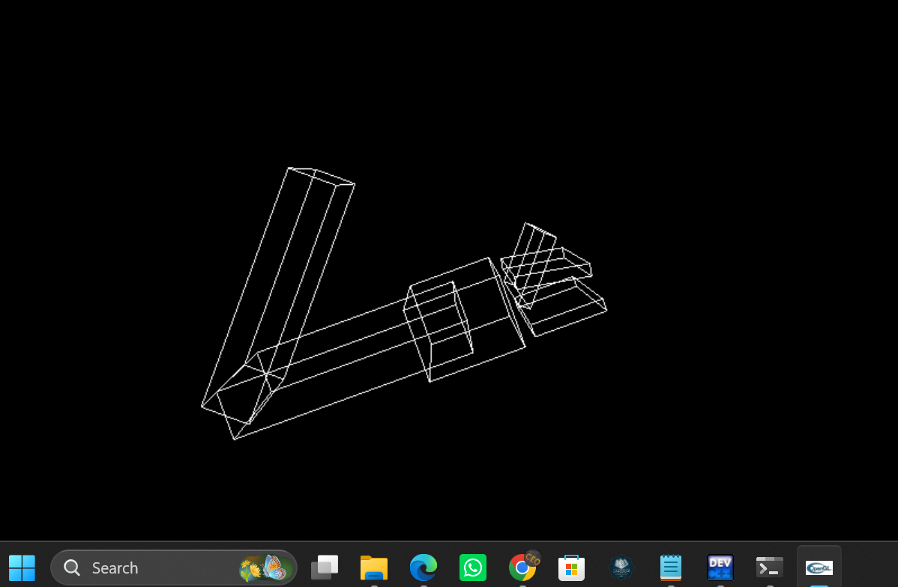
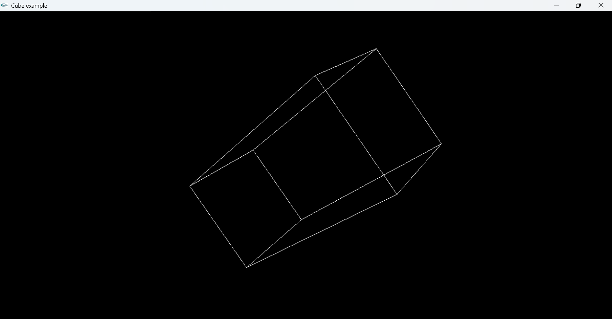
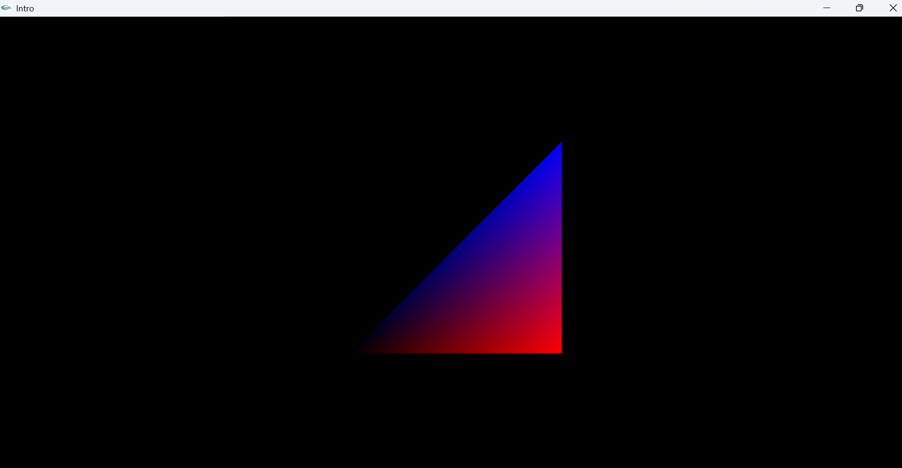

# Pertemuan 4

Praktikum Grafika dan Teknik Interaksi (GTI) Pertemuan 4.

---

## Lengan Bergerak

Implementasi animasi lengan bergerak menggunakan transformasi grafika komputer.

### Hasil

---

## Kubus Berotasi

Implementasi objek kubus 3D yang dapat berotasi.

### Hasil

---

## Proyeksi

Implementasi proyeksi objek 3D ke bidang 2D.

### Hasil

---

## Author

Rozan
